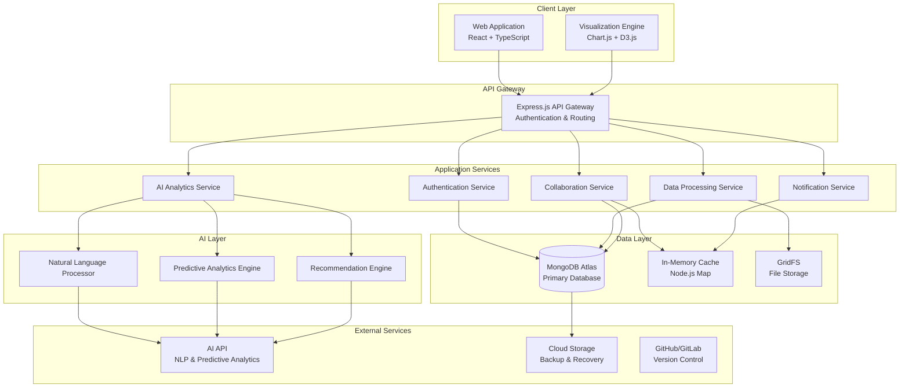
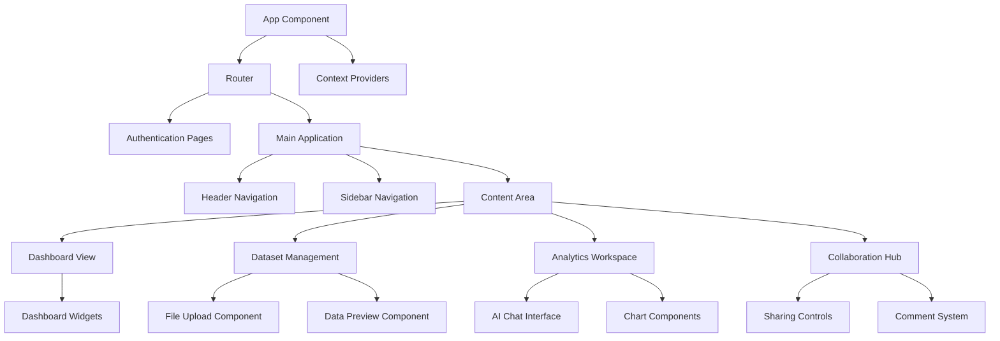
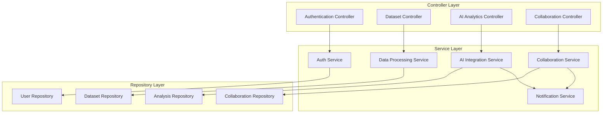
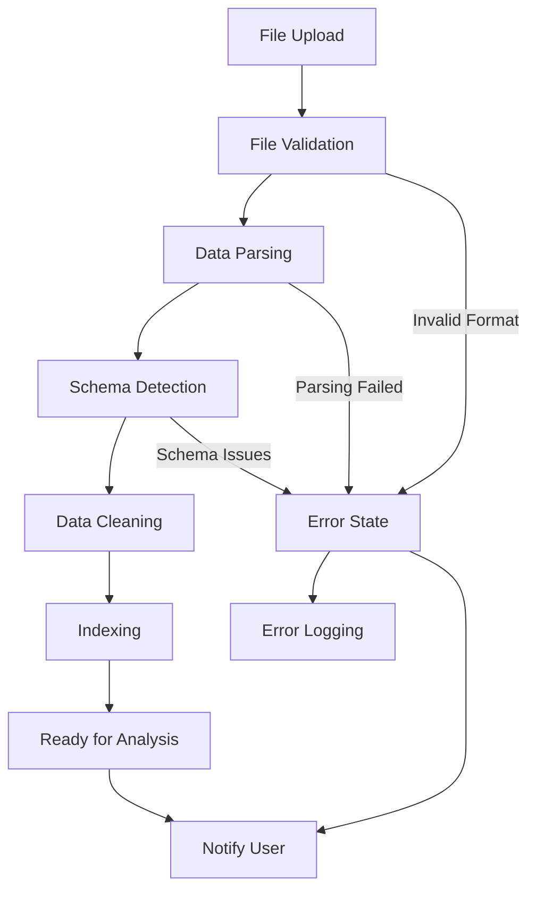
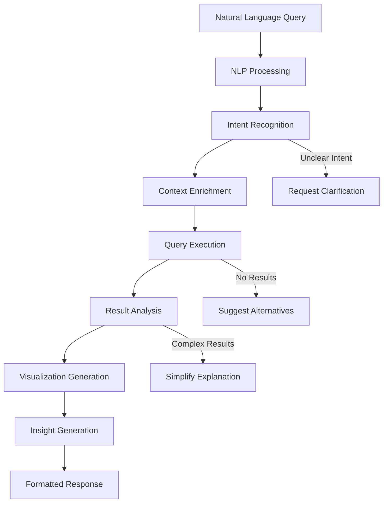

# ClarifAI - Intelligent Analytics Platform Design

## Overview

ClarifAI is a comprehensive web-based intelligent analytics platform that transforms raw datasets into meaningful insights through AI-powered natural language processing and automated visualization. The platform serves businesses, researchers, and policymakers by providing an intuitive interface for data exploration, predictive analytics, and collaborative decision-making.

### Core Value Proposition
- **Natural Language Analytics**: Users query datasets using plain English, eliminating technical barriers
- **AI-Driven Insights**: Automated pattern recognition, trend analysis, and predictive forecasting
- **Collaborative Intelligence**: Real-time sharing of dashboards, annotations, and AI-generated reports
- **Scalable Architecture**: Cloud-native design supporting large datasets and concurrent users

### Target User Segments

| User Type | Primary Goals | Key Features Used |
|-----------|---------------|-------------------|
| Business Owners & Managers | Operational insights, growth opportunities | Predictive analytics, executive dashboards |
| Data Analysts & Researchers | Streamlined analytics workflow | AI assistant, advanced visualizations |
| Marketing Teams | Campaign optimization, consumer behavior | Predictive modeling, trend analysis |
| Policy Makers & Planners | Data-driven governance decisions | Forecasting, impact analysis |

## Technology Stack & Dependencies

### Frontend Layer
- **Framework**: React.js with TypeScript for component-based development
- **Visualization**: Chart.js and D3.js for dynamic, interactive data visualizations
- **State Management**: Context API with useReducer for complex state orchestration
- **UI Components**: CSS modules with custom component library
- **Real-time Updates**: WebSocket client for live collaboration features

### Backend Layer
- **Runtime**: Node.js with Express.js framework
- **Language**: TypeScript for end-to-end type safety
- **API Architecture**: RESTful APIs with custom middleware
- **Authentication**: JWT-based authentication with role-based access control
- **WebSocket**: Socket.io for real-time collaboration and notifications

### Database Layer
- **Primary Database**: MongoDB Atlas for flexible document storage
- **Data Modeling**: Mongoose ODM for schema validation and relationship management
- **Caching**: In-memory caching with Node.js Map objects and MongoDB query optimization
- **File Storage**: MongoDB GridFS for dataset file storage

### AI Integration Layer
- **NLP Processing**: AI API integration for natural language query interpretation
- **Analytics Engine**: Custom AI service for predictive modeling and trend analysis
- **Recommendation System**: Machine learning algorithms for actionable insights

## Architecture

### System Architecture Overview



### Component Architecture

#### Frontend Component Hierarchy



#### Backend Service Architecture



## Data Models & Database Schema

### User Management Schema

| Field | Type | Description | Constraints |
|-------|------|-------------|-------------|
| _id | ObjectId | Unique user identifier | Primary key |
| email | String | User email address | Unique, required |
| passwordHash | String | Encrypted password | Required |
| firstName | String | User first name | Required |
| lastName | String | User last name | Required |
| role | String | User role (admin, analyst, viewer) | Enum, required |
| organizationId | ObjectId | Reference to organization | Optional |
| preferences | Object | UI preferences and settings | Default empty |
| lastLogin | Date | Last login timestamp | Auto-updated |
| isActive | Boolean | Account status | Default true |
| createdAt | Date | Account creation date | Auto-generated |
| updatedAt | Date | Last modification date | Auto-updated |

### Dataset Schema

| Field | Type | Description | Constraints |
|-------|------|-------------|-------------|
| _id | ObjectId | Unique dataset identifier | Primary key |
| name | String | Dataset display name | Required |
| description | String | Dataset description | Optional |
| fileId | ObjectId | GridFS file reference | Required |
| uploadedBy | ObjectId | User who uploaded dataset | Required |
| organizationId | ObjectId | Organization reference | Required |
| schema | Object | Detected data schema | Auto-generated |
| metadata | Object | File metadata (size, type, etc.) | Auto-generated |
| processingStatus | String | Processing state | Enum (pending, processing, ready, error) |
| tags | Array[String] | Searchable tags | Optional |
| isPublic | Boolean | Public sharing status | Default false |
| accessPermissions | Array[Object] | User access controls | Required |
| createdAt | Date | Upload timestamp | Auto-generated |
| updatedAt | Date | Last modification date | Auto-updated |

### Analysis Session Schema

| Field | Type | Description | Constraints |
|-------|------|-------------|-------------|
| _id | ObjectId | Unique session identifier | Primary key |
| datasetId | ObjectId | Associated dataset | Required |
| userId | ObjectId | Session owner | Required |
| title | String | Session title | Required |
| queries | Array[Object] | Natural language queries and responses | Required |
| visualizations | Array[Object] | Generated charts and graphs | Optional |
| insights | Array[Object] | AI-generated insights | Optional |
| predictions | Array[Object] | Predictive analysis results | Optional |
| collaborators | Array[ObjectId] | Shared user access | Optional |
| isShared | Boolean | Public sharing status | Default false |
| lastActivity | Date | Last interaction timestamp | Auto-updated |
| createdAt | Date | Session creation date | Auto-generated |

### Collaboration Schema

| Field | Type | Description | Constraints |
|-------|------|-------------|-------------|
| _id | ObjectId | Unique collaboration identifier | Primary key |
| resourceType | String | Type of shared resource | Enum (dashboard, analysis, dataset) |
| resourceId | ObjectId | Reference to shared resource | Required |
| ownerId | ObjectId | Resource owner | Required |
| participants | Array[Object] | Collaborator details and permissions | Required |
| comments | Array[Object] | Discussion threads | Optional |
| annotations | Array[Object] | Visual annotations on charts | Optional |
| version | Number | Collaboration version | Auto-incremented |
| lastModified | Date | Last collaboration activity | Auto-updated |
| createdAt | Date | Collaboration start date | Auto-generated |

## API Endpoints Reference

### Authentication Endpoints

| Method | Endpoint | Description | Authentication | Request Schema | Response Schema |
|--------|----------|-------------|----------------|----------------|-----------------|
| POST | /api/auth/register | User registration | None | { email, password, firstName, lastName, role } | { user, token } |
| POST | /api/auth/login | User authentication | None | { email, password } | { user, token } |
| POST | /api/auth/logout | User logout | JWT | None | { message } |
| GET | /api/auth/me | Get current user | JWT | None | { user } |
| PUT | /api/auth/profile | Update user profile | JWT | { firstName, lastName, preferences } | { user } |
| POST | /api/auth/reset-password | Password reset request | None | { email } | { message } |

### Dataset Management Endpoints

| Method | Endpoint | Description | Authentication | Request Schema | Response Schema |
|--------|----------|-------------|----------------|----------------|-----------------|
| POST | /api/datasets/upload | Upload new dataset | JWT | Multipart form data | { dataset, processingId } |
| GET | /api/datasets | List user datasets | JWT | Query params: page, limit, search | { datasets, pagination } |
| GET | /api/datasets/:id | Get dataset details | JWT + Permission | None | { dataset, schema, metadata } |
| PUT | /api/datasets/:id | Update dataset metadata | JWT + Permission | { name, description, tags } | { dataset } |
| DELETE | /api/datasets/:id | Delete dataset | JWT + Permission | None | { message } |
| GET | /api/datasets/:id/preview | Preview dataset content | JWT + Permission | Query params: limit, offset | { rows, totalCount } |

### AI Analytics Endpoints

| Method | Endpoint | Description | Authentication | Request Schema | Response Schema |
|--------|----------|-------------|----------------|----------------|-----------------|
| POST | /api/analytics/query | Natural language query | JWT | { datasetId, query, sessionId } | { answer, visualizations, insights } |
| POST | /api/analytics/predict | Generate predictions | JWT | { datasetId, targetColumn, horizon } | { predictions, confidence, metrics } |
| GET | /api/analytics/insights/:datasetId | Auto-generated insights | JWT | None | { insights, trends, anomalies } |
| POST | /api/analytics/recommend | Get recommendations | JWT | { datasetId, context, goals } | { recommendations, reasoning } |
| GET | /api/analytics/sessions/:userId | List analysis sessions | JWT | Query params: page, limit | { sessions, pagination } |

### Collaboration Endpoints

| Method | Endpoint | Description | Authentication | Request Schema | Response Schema |
|--------|----------|-------------|----------------|----------------|-----------------|
| POST | /api/collaboration/share | Share resource | JWT | { resourceType, resourceId, participants, permissions } | { collaboration } |
| GET | /api/collaboration/:id | Get collaboration details | JWT + Permission | None | { collaboration, participants, activity } |
| POST | /api/collaboration/:id/comment | Add comment | JWT + Permission | { comment, threadId } | { comment } |
| PUT | /api/collaboration/:id/annotation | Add/update annotation | JWT + Permission | { annotation, chartId, position } | { annotation } |
| DELETE | /api/collaboration/:id | End collaboration | JWT + Permission | None | { message } |

## Business Logic Layer

### Data Processing Pipeline



### AI Query Processing Workflow



### Predictive Analytics Engine

The predictive analytics engine processes historical data to generate forecasts and trend predictions:

**Input Processing**:
- Validates dataset suitability for predictive modeling
- Identifies temporal patterns and seasonality
- Handles missing data through interpolation or exclusion
- Normalizes data ranges for consistent model input

**Model Selection**:
- Automatic algorithm selection based on data characteristics
- Time series models for temporal data (ARIMA, Prophet)
- Regression models for relationship prediction
- Classification models for categorical predictions

**Validation & Confidence**:
- Cross-validation using historical data splits
- Confidence intervals for prediction reliability
- Model performance metrics (RMSE, MAE, R-squared)
- Automated model retraining based on new data

### Recommendation System

The recommendation engine analyzes user behavior and data patterns to suggest actionable insights:

**Pattern Recognition**:
- Identifies statistically significant trends and correlations
- Detects anomalies and outliers requiring attention
- Recognizes seasonal patterns and cyclical behaviors
- Maps relationships between variables

**Context-Aware Suggestions**:
- Considers user role and organizational context
- Prioritizes recommendations based on business impact
- Provides reasoning and supporting evidence
- Suggests specific actions with expected outcomes

## Middleware & Interceptors

### Authentication Middleware

Implements JWT-based authentication system with role-based access control across all protected endpoints. The middleware:
- Extracts and validates JWT tokens from request headers
- Verifies token signature and expiration using jsonwebtoken library
- Loads user context and permissions from MongoDB
- Enforces role-based route access through custom authorization middleware
- Logs authentication attempts and failures through Winston logger

### Caching Strategy

Implements efficient caching without external dependencies:
- **In-Memory Caching**: Node.js Map objects for frequently accessed data
- **Query Result Caching**: MongoDB query optimization with proper indexing
- **Session Management**: Payload CMS built-in session handling
- **Static Asset Caching**: Browser-based caching for static resources

### Request Validation

Validates incoming requests using Express.js middleware and validation libraries:
- Parameter validation using Joi or express-validator for all endpoint inputs
- File type and size validation for uploads using multer middleware
- Rate limiting using express-rate-limit to prevent API abuse
- Request sanitization using express-mongo-sanitize to prevent injection attacks

### Data Access Control

Implements fine-grained permissions through custom Express.js middleware:
- **Owner Access**: Full CRUD operations on owned resources through database ownership validation
- **Collaborator Access**: Read and comment permissions on shared resources via role-based middleware
- **Organization Access**: Access to organization-wide public datasets through organization membership validation
- **Admin Access**: Organization-wide administrative privileges via role hierarchy validation

### Error Handling

Centralized error handling through Express.js error middleware:
- Structured error responses using custom error classes and middleware
- Detailed logging through Winston for debugging and monitoring
- User-friendly error messages with proper HTTP status codes
- Automatic error reporting through webhook integrations for critical failures

## Routing & Navigation

### Frontend Routing Structure

```mermaid
graph TD
    ROOT[/ Root] --> AUTH{Authenticated?}
    AUTH -->|No| LOGIN[/login]
    AUTH -->|No| REGISTER[/register]
    AUTH -->|Yes| DASHBOARD[/dashboard]
    
    DASHBOARD --> OVERVIEW[/dashboard/overview]
    DASHBOARD --> DATASETS[/dashboard/datasets]
    DASHBOARD --> ANALYTICS[/dashboard/analytics]
    DASHBOARD --> COLLAB[/dashboard/collaboration]
    
    DATASETS --> DATASET_LIST[/datasets]
    DATASETS --> DATASET_DETAIL[/datasets/:id]
    DATASETS --> UPLOAD[/datasets/upload]
    
    ANALYTICS --> ANALYSIS_LIST[/analytics]
    ANALYTICS --> ANALYSIS_SESSION[/analytics/:sessionId]
    ANALYTICS --> NEW_ANALYSIS[/analytics/new]
    
    COLLAB --> SHARED_RESOURCES[/collaboration/shared]
    COLLAB --> COLLABORATION_DETAIL[/collaboration/:id]
```

### Navigation Patterns

**Role-Based Navigation**:
- **Admin Users**: Full access to all sections including user management
- **Analyst Users**: Access to datasets, analytics, and collaboration features
- **Viewer Users**: Read-only access to shared dashboards and reports

**Contextual Navigation**:
- Breadcrumb navigation for deep hierarchies
- Quick access toolbar for frequently used features
- Smart navigation suggestions based on user activity
- Mobile-responsive navigation with collapsible menus

## State Management

### Frontend State Architecture

The application uses React Context API with useReducer for complex state management:

**Global State Contexts**:
- **AuthContext**: User authentication state and permissions
- **DatasetContext**: Dataset list, metadata, and processing status
- **AnalyticsContext**: Active analysis sessions and query results
- **CollaborationContext**: Shared resources and real-time updates
- **NotificationContext**: System notifications and alerts

**Local Component State**:
- Form inputs and validation states
- UI interaction states (modals, dropdowns)
- Temporary data for previews and drafts
- Chart configuration and visualization options

### State Update Patterns

**Optimistic Updates**:
- Immediate UI feedback for user actions
- Rollback mechanism for failed operations
- Loading states for ongoing operations
- Error boundaries for graceful failure handling

**Real-time Synchronization**:
- WebSocket integration for live collaboration
- Automatic state updates for shared resources using in-memory caching
- Conflict resolution for concurrent edits through custom conflict resolution logic
- Offline state management with sync on reconnection using browser storage

## Testing Strategy

### Unit Testing

**Frontend Testing**:
- Component testing with React Testing Library
- Hook testing for custom state management
- Utility function testing with Jest
- Visual regression testing for chart components

**Backend Testing**:
- Service layer unit tests with Jest
- Express.js route testing with Supertest
- Custom middleware testing with mock requests and responses
- AI integration testing with mocked external APIs

### Integration Testing

**API Integration**:
- End-to-end API testing with Supertest for Express.js routes
- Database integration testing with MongoDB test instances
- Authentication flow testing using JWT token validation
- File upload and processing pipeline testing with GridFS

**Frontend Integration**:
- User journey testing with Cypress
- Cross-browser compatibility testing
- Mobile responsiveness testing
- Accessibility compliance testing

### Performance Testing

**Load Testing**:
- API endpoint performance under concurrent load
- Database query optimization validation
- WebSocket connection scalability testing
- Large dataset processing performance metrics

**User Experience Testing**:
- Page load time optimization
- Chart rendering performance
- Real-time collaboration responsiveness
- Mobile device performance testing