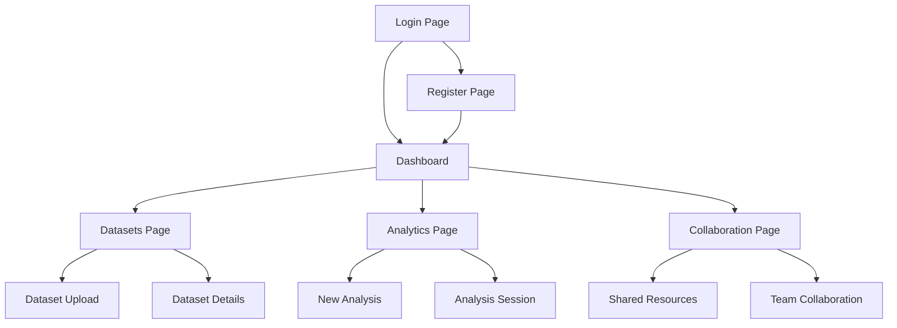
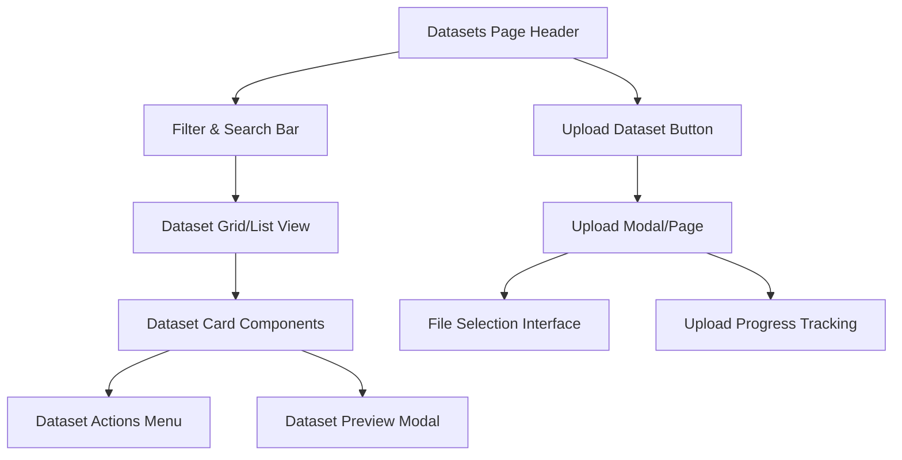
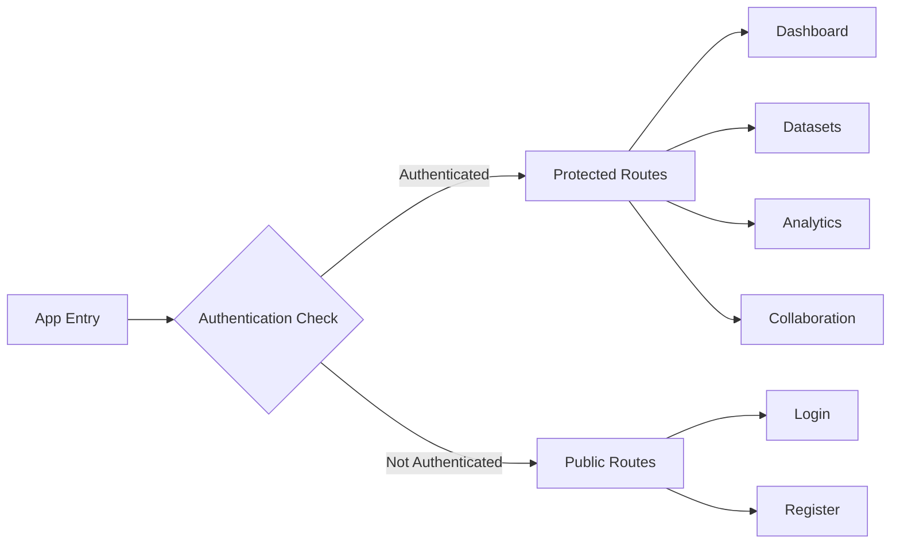

# Page Functionality Verification Design

## Overview

This design addresses the systematic verification and enhancement of page functionality across the ClarifAI web application. The goal is to ensure all pages are fully functional, interactive elements are clickable, and the user experience is seamless throughout the application.

## Current Application Structure

### Page Inventory

| Page | Route | Status | Components |
|------|-------|--------|------------|
| Login Page | `/login` | ✅ Functional | Form inputs, submit button, navigation link |
| Register Page | `/register` | ⚠️ Basic Implementation | Form structure exists |
| Dashboard Page | `/dashboard`, `/` | ✅ Functional | Stats cards, action buttons, dataset list |
| Datasets Page | `/datasets/*` | ❌ Placeholder Only | Minimal content, no functionality |
| Analytics Page | `/analytics/*` | ❌ Placeholder Only | Minimal content, no functionality |
| Collaboration Page | `/collaboration/*` | ❌ Placeholder Only | Minimal content, no functionality |

### Navigation Structure

## Functionality Assessment

### Critical Issues Identified

#### 1. Incomplete Page Implementation
- **Datasets Page**: Contains only placeholder content with no interactive elements
- **Analytics Page**: Missing core functionality and user interface components
- **Collaboration Page**: No implemented features or navigation paths

#### 2. Navigation Consistency
- Header navigation uses anchor tags instead of React Router Link components
- Sidebar quick actions point to non-existent nested routes
- Missing breadcrumb navigation for nested pages

#### 3. Interactive Element Gaps
- Dashboard action buttons lack event handlers
- Missing form validation on authentication pages
- No loading states for data-dependent operations

## Enhanced Page Functionality Design

### Authentication Flow Enhancement

#### Login Page Improvements
| Element | Current State | Enhancement Required |
|---------|---------------|---------------------|
| Form Validation | Basic HTML validation | Real-time field validation with error messages |
| Submit Button | Functional | Enhanced loading states and success feedback |
| Forgot Password Link | Missing | Add password recovery flow |
| Social Login Options | Missing | Optional OAuth integration points |

#### Register Page Requirements
| Component | Description | Validation Rules |
|-----------|-------------|------------------|
| User Information Form | First name, last name, email, password fields | Email format, password strength, required fields |
| Terms Agreement | Checkbox for terms and conditions | Required acceptance |
| Success Confirmation | Registration success message and redirect | Auto-redirect to dashboard |
| Error Handling | Display registration errors clearly | Field-specific error messages |

### Main Application Pages

#### Dashboard Page Enhancements

**Interactive Elements Specification**
| Element | Functionality | Action Result |
|---------|---------------|---------------|
| New Analysis Button | Triggers analysis creation workflow | Navigate to analytics page with new session |
| Upload Dataset Button | Opens file upload dialog | Navigate to datasets upload page |
| Dataset Action Buttons | Context-specific actions per dataset | Navigate to dataset details or start analysis |
| Continue Analysis Button | Resume existing analysis session | Navigate to specific analysis session |
| View All Links | Navigate to respective section pages | Navigate to datasets/analytics pages |

**Data Integration Requirements**
- Real-time statistics updates from backend services
- Dynamic content loading based on user permissions
- Responsive layout adaptation for different screen sizes

#### Datasets Page Complete Design

**Page Structure**

**Core Functionality Components**
| Component | Purpose | Interactions |
|-----------|---------|-------------|
| Dataset List/Grid | Display all user datasets | Sort, filter, search, pagination |
| Upload Interface | File upload and processing | Drag-and-drop, file validation, progress tracking |
| Dataset Details Modal | Show dataset metadata and preview | Edit metadata, delete dataset, start analysis |
| Bulk Actions Toolbar | Operations on multiple datasets | Select all, bulk delete, bulk export |

#### Analytics Page Architecture

**Session Management Design**
| Feature | Description | User Actions |
|---------|-------------|-------------|
| Analysis Session Creation | Initialize new data analysis workflow | Select dataset, choose analysis type |
| Query Interface | Natural language query input | Text input, query suggestions, history |
| Visualization Builder | Interactive chart and graph creation | Chart type selection, data field mapping |
| Results Dashboard | Display analysis results and insights | Export results, save analysis, share session |

**Interactive Components Specification**
- AI-powered query input with auto-completion
- Dynamic visualization creation and editing
- Real-time collaboration features
- Analysis history and session management

#### Collaboration Page Features

**Real-time Collaboration Elements**
| Component | Functionality | Technical Requirements |
|-----------|---------------|----------------------|
| Team Dashboard | Overview of shared resources and activities | User presence indicators, activity feed |
| Shared Analysis Sessions | Multi-user analysis collaboration | Socket-based real-time updates |
| Resource Sharing Interface | Share datasets and analyses with team members | Permission management, access controls |
| Communication Tools | In-app messaging and comments | Message threading, notifications |

## Navigation and Routing Enhancement

### Route Structure Optimization

**Protected Route Implementation**

### Link Component Standardization

**Navigation Component Requirements**
| Element | Current Implementation | Required Change |
|---------|----------------------|-----------------|
| Header Navigation | HTML anchor tags | React Router Link components |
| Sidebar Links | Mixed anchor/button elements | Consistent Link components with active states |
| Action Buttons | Generic onClick handlers | Specific navigation and state management |

## User Experience Flow Design

### Page Transition Patterns

**Loading State Management**
| Transition | Loading Indicator | Error Handling |
|------------|-------------------|----------------|
| Page Navigation | Skeleton loading screens | Error boundary with retry options |
| Data Fetching | Spinner or progress indicators | Toast notifications for errors |
| Form Submission | Button loading states | Inline validation messages |

### Accessibility and Responsiveness

**Interactive Element Standards**
- All clickable elements must have proper focus states
- Keyboard navigation support for all interactive components
- Screen reader compatibility with proper ARIA labels
- Touch-friendly sizing for mobile devices

## Implementation Strategy

### Phase 1: Critical Functionality
1. Complete placeholder page implementations (Datasets, Analytics, Collaboration)
2. Fix navigation routing and link components
3. Implement proper loading and error states

### Phase 2: Enhanced Interactivity
1. Add comprehensive form validation
2. Implement real-time data updates
3. Add interactive dashboard elements

### Phase 3: Advanced Features
1. Real-time collaboration features
2. Advanced analytics tools
3. Comprehensive search and filtering

### Testing Requirements

**Functionality Verification Checklist**
| Test Category | Test Cases |
|---------------|------------|
| Navigation Testing | All links navigate to correct routes, back button functionality |
| Form Interaction | Input validation, submission handling, error states |
| Button Functionality | All buttons trigger expected actions, loading states work |
| Responsive Design | Layout adapts properly across device sizes |
| Accessibility | Keyboard navigation, screen reader compatibility |

**User Journey Testing**
- Complete user registration and login flow
- Dataset upload and management workflow
- Analysis creation and collaboration process
- Cross-page navigation and state persistence

This design ensures comprehensive functionality verification and enhancement across all pages of the ClarifAI application, with particular focus on completing the placeholder pages and ensuring seamless user interactions throughout the application.